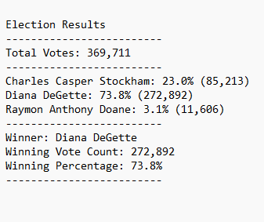

# Challenge-3

## Election Results 

##
## Overview

This challenge used python to gather poll information for Election results. Using code to the requested data, I was able to find the results of how many votes, votes by county, largest county turnout and the winner of the elction. See screen shot image for details linked below.

By using this script, we can change it to be ran with any election in the state to pull the same data by changing out the CSV file used and changing how many candidates information you want pulled from the data like runner up or top three candidates.
